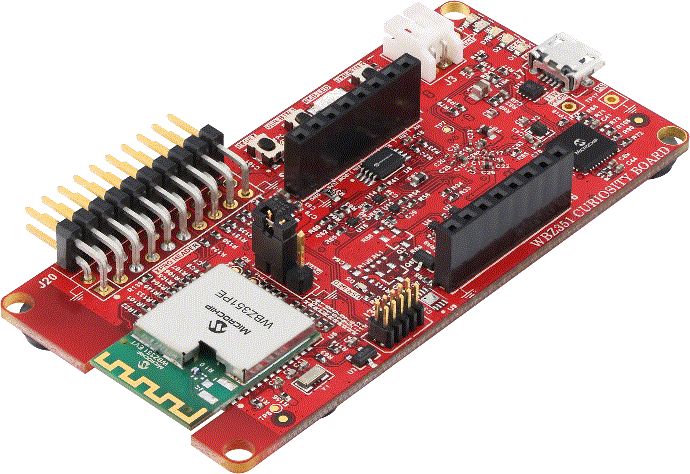

.. zephyr:board:: wbz351_curiosity

Overview
********

The **EV19J06A - WBZ351 Curiosity Board** is a development platform for rapid
prototyping with Microchip's WBZ351PE Bluetooth Low Energy 5.2 and Zigbee RF
module. It includes an integrated PICkit On-Board 4 (PKOB4) programmer/debugger,
a mikroBUS socket, and an XPRO header, requiring only a Micro-B USB cable to
power, program and debug the module.

EV19J06A supports the following drivers:

* UART
* Flash
* GPIO
* Pin Control
* Entropy
* DMA
* RTC
* I2C
* SPI
* PWM
* Clock Control
* Reset

Hardware
********

* **WBZ351PE Module**: Fully RF-certified wireless module supporting BLE 5.2 and Zigbee.
* **PIC32CX-BZ3 / WBZ35x SoC**: ARM Cortex-M4 based wireless SoC integrated on the board.
* **Power Supply**: Supports USB or Li-Po battery-powered operation.
* **On-board Debugger/Programmer**: MPLAB PICkit On-Board 4 (PKOB4) based on the ATSAME70 MCU for programming and debugging.
* **USB-to-UART Converter**: MCP2200 USB-to-UART serial converter with hardware flow control.
* **Battery Charger**: MCP73871 Li-Ion/LiPo battery charger with power path management.
* **mikroBUS Socket** (J4): Supports MikroElektronika Click adapter boards for expansion.
* **XPRO Header** (J20): Interface for QT7/T9 Xplained Pro touch kits.
* **External QSPI Flash**: Microchip SST26VF064B 64-Mbit external QSPI Flash memory.
* **Temperature Sensor**: MCP9700A low-power analog temperature sensor.
* **Secondary Oscillator**: 32.768 kHz crystal connected to SOSC pins (PA11, PA12).
* **Debug Connector**: 10-pin Cortex Debug connector (J36) for external debugging support.

**Design Files:**
`WBZ351 Curiosity Board Hardware Design Documentation <https://ww1.microchip.com/downloads/aemDocuments/documents/WSG/ProductDocuments/BoardDesignFiles/WBZ351+Curiosity+Board+Design+Package.zip>`_

Supported Features
==================

.. zephyr:board-supported-hw::

Connections and IOs
===================

LEDs
----

+-----------+-------------------+-----------------------------------------+
| Label     | Pin               | Description                             |
+===========+===================+=========================================+
| D5        | PB7               | User LED (blue); active low             |
+-----------+-------------------+-----------------------------------------+
| D6 (Red)  | PB0               | RGB LED - Red channel (PWM)             |
+-----------+-------------------+-----------------------------------------+
| D6 (Green)| PB3               | RGB LED - Green channel (PWM)           |
+-----------+-------------------+-----------------------------------------+
| D6 (Blue) | PB5               | RGB LED - Blue channel (PWM)            |
+-----------+-------------------+-----------------------------------------+

.. note::
   PB7 is also the SWO pin. During a debug session the user LED (D5) will
   remain ON; it operates normally after exiting the debug session.

   PB0 (Red) and PB5 (Blue) on the RGB LED are multiplexed with CVD4/CVD1
   and are connected to the XPRO header for the Out-of-Box demo. Only the
   Green channel is functional during the OOB demo.

Buttons
-------

+------------+-------------------+-----------------------------------------+
| Label      | Pin               | Description                             |
+============+===================+=========================================+
| SW1        | NMCLR             | Reset switch                            |
+------------+-------------------+-----------------------------------------+
| SW2        | PB9 / INT0        | User button 1; wakes WBZ351PE from      |
|            |                   | power-down mode                         |
+------------+-------------------+-----------------------------------------+
| SW3        | PA4               | User button 2                           |
+------------+-------------------+-----------------------------------------+

Serial Port
-----------

The WBZ351PE module exposes a UART via the on-board MCP2200 USB-to-UART
converter (U18). The signals are routed as follows:

+------------------+----------------------------+
| MCP2200 Signal   | WBZ351PE Pin               |
+==================+============================+
| TX               | PA6 (SERCOM0_PAD1) - RX    |
+------------------+----------------------------+
| RX               | PA5 (SERCOM0_PAD0) - TX    |
+------------------+----------------------------+
| RTS              | PB4 (UART_CTS)             |
+------------------+----------------------------+
| CTS              | PA3 (UART_RTS)             |
+------------------+----------------------------+

.. note::
   PB4 is by default connected to the XPRO header (J20). To use UART CTS,
   resistor R3 must be populated.

mikroBUS Socket (J4)
--------------------

The mikroBUS socket exposes SPI, I2C, UART, PWM, analog and interrupt lines:

+--------+----------+---------------------------------------+-----------------------------+
| Pin    | Name     | WBZ351PE Pin                          | Description                 |
+========+==========+=======================================+=============================+
| 1      | AN       | PB1 / AN5 / CVD5                      | ADC analog input            |
+--------+----------+---------------------------------------+-----------------------------+
| 2      | RST      | PB2 / RST / CVD6                      | General purpose I/O         |
+--------+----------+---------------------------------------+-----------------------------+
| 3      | CS       | PA9 / SERCOM1_PAD2 / SPI_SS           | SPI client select           |
+--------+----------+---------------------------------------+-----------------------------+
| 4      | SCK      | PA8 / SERCOM1_PAD1 / SPI_SCK / RX     | SPI clock (shared UART RX)  |
+--------+----------+---------------------------------------+-----------------------------+
| 5      | MISO     | PA10 / SERCOM1_PAD3 / SPI_MISO        | SPI MISO                    |
+--------+----------+---------------------------------------+-----------------------------+
| 6      | MOSI     | PA7 / SERCOM1_PAD0 / SPI_MOSI / TX    | SPI MOSI (shared UART TX)   |
+--------+----------+---------------------------------------+-----------------------------+
| 7      | +3.3V    | +3V                                   | 3V power                    |
+--------+----------+---------------------------------------+-----------------------------+
| 8      | GND      | GND                                   | Ground                      |
+--------+----------+---------------------------------------+-----------------------------+
| 9      | GND      | GND                                   | Ground                      |
+--------+----------+---------------------------------------+-----------------------------+
| 10     | +5V      | +5V                                   | 5V power                    |
+--------+----------+---------------------------------------+-----------------------------+
| 11     | SDA      | PA13 / I2C_SERCOM_PAD0 / SDA          | I2C data                    |
+--------+----------+---------------------------------------+-----------------------------+
| 12     | SCL      | PA14 / I2C_SERCOM_PAD1 / SCL          | I2C clock                   |
+--------+----------+---------------------------------------+-----------------------------+
| 13     | TX       | PA7 / SERCOM1_PAD0 / SPI_MOSI / TX    | UART TX (shared SPI MOSI)   |
+--------+----------+---------------------------------------+-----------------------------+
| 14     | RX       | PA8 / SERCOM1_PAD1 / SPI_SCK / RX     | UART RX (shared SPI SCK)    |
+--------+----------+---------------------------------------+-----------------------------+
| 15     | INT      | PB10 / INT / PWM                      | Interrupt (shared PWM)      |
+--------+----------+---------------------------------------+-----------------------------+
| 16     | PWM      | PB10 / INT / PWM                      | PWM (shared INT)            |
+--------+----------+---------------------------------------+-----------------------------+

.. note::
   INT and PWM share PB10. Depopulate R120 to isolate PWM or R121 to isolate
   INT. SPI SCK and UART RX share PA8 (depopulate R123 / R122 to isolate).
   SPI MOSI and UART TX share PA7 (depopulate R125 / R124 to isolate).

QSPI Flash (U7)
---------------

The on-board 64-Mbit SST26VF064B-104I/MF QSPI flash is connected as follows:

+-------------+----------------------------+
| Flash Pin   | WBZ351PE Pin               |
+=============+============================+
| CE          | PB13 (QSPI_CS)             |
+-------------+----------------------------+
| SI / SIO0   | PA0 (QSPI_DATA0)           |
+-------------+----------------------------+
| SO / SIO1   | PB12 (QSPI_DATA1)          |
+-------------+----------------------------+
| WP / SIO2   | PB11 (QSPI_DATA2)          |
+-------------+----------------------------+
| Hold / SIO3 | PA2 (QSPI_DATA3)           |
+-------------+----------------------------+
| SCK         | PA1 (QSPI_SCK)             |
+-------------+----------------------------+

Temperature Sensor (U3)
-----------------------

The Microchip MCP9700A analog temperature sensor output is connected to
**PB6 (AN2)** of the WBZ351PE module.

For detailed schematics, pin assignments, and signal descriptions, see the
`WBZ351 Curiosity Board User’s Guide <https://ww1.microchip.com/downloads/aemDocuments/documents/WSG/ProductDocuments/UserGuides/WBZ351-Curiosity-Board-User-Guide-DS50003580.pdf>`_

Programming and Debugging
*************************

This section describes how to flash and debug applications on the Microchip Wireless WBZ351 Curiosity board using Zephyr.

**Supported Debuggers**

.. list-table::
   :header-rows: 1
   :widths: 20 20 20 20 20

   * -
     - Flash
     - Debug
     - Debug Server
     - Debug Tool
   * - Segger
     - ✓
     - ✓
     - ✓
     - J-Link
   * - OpenOCD
     - ✓
     - ✓
     - ✓
     - PKOB4, PICkit Basic

Flashing
========

Follow the steps below to build and flash your application:

1. Open a terminal and change to the Zephyr workspace directory:

   .. code-block:: console

      cd zephyr

2. Build the application using the following command:

   .. code-block:: console

      west build -p always -b wbz351_curiosity .\samples\basic\blinky\

3. After a successful build, connect the WBZ351 device to your machine.

4. Flash the device using the west flash command:

   .. code-block:: console

      west flash --hex-file build/zephyr/zephyr_signed.hex

5. Ensure the flash process completes successfully. You should see confirmation messages in the terminal.

Debugging
=========

To debug the WBZ351 application using Visual Studio Code:

1. Ensure the application is built for the WBZ351 board.
2. Install the cortex-debug extension in Visual Studio Code.
3. Open the workspace and click the **Run and Debug** icon on the left sidebar.
4. If launch.json and tasks.json files are already present, VS Code will automatically start the debug session.
5. If prompted to create a new launch.json, select the **Cortex Debug** debugger option.
6. Replace the contents of launch.json with:

   .. code-block:: json

      {
        "version": "2.0.0",
        "configurations": [
          {
            "name": "Debug WBZ351",
            "type": "cortex-debug",
            "request": "attach",
            "servertype": "openocd",
            "cwd": "C:\\developers\\zephyr\\",
            "executable": "<path to zephyr project>/build/zephyr/zephyr.elf",
            "device": "WBZ351",
            "configFiles": [
              "interface/cmsis-dap.cfg",
              "target/wbz351.cfg"
            ],
            "gdbPath": "<path to zephyr sdk>/arm-zephyr-eabi/bin/arm-zephyr-eabigdb.exe",
            "preLaunchTask": "flash_wbz351_hex",
            "postRestartCommands": [
              "symbol-file <path to zephyr project>/build/zephyr/zephyr.elf",
              "monitor reset halt",
              "break main"
            ],
            "showDevDebugOutput": "none"
          }
        ]
      }

7. Create tasks.json inside .vscode with:

   .. code-block:: json

      {
        "version": "2.0.0",
        "tasks": [
          {
            "label": "flash_wbz351_hex",
            "type": "shell",
            "command": "openocd",
            "args": [
              "-f", "interface/cmsis-dap.cfg",
              "-f", "target/wbz351.cfg",
              "-c", "init",
              "-c", "reset halt",
              "-c", "program <path to zephyr project>/build/zephyr/zephyr_signed.hex reset exit"
            ],
            "problemMatcher": [],
            "group": {
              "kind": "build",
              "isDefault": true
            }
          }
        ]
      }

8. Connect the WBZ351 Curiosity board.
9. Click the **Run and Debug** icon again and select the WBZ351 debug option.
10. Confirm that the debugger hits the breakpoint in main.c. Press **Continue** to proceed.

References
**********

.. target-notes::

.. _WBZ351 Curiosity Board product page:
   https://www.microchip.com/en-us/development-tool/ev19j06a

.. _WBZ351 Curiosity Board User Guide:
   https://ww1.microchip.com/downloads/aemDocuments/documents/WSG/ProductDocuments/UserGuides/WBZ351-Curiosity-Board-User-Guide-DS50003580.pdf

.. _WBZ351 Curiosity Board Hardware Design Files:
   https://ww1.microchip.com/downloads/aemDocuments/documents/WSG/ProductDocuments/BoardDesignFiles/WBZ351+Curiosity+Board+Design+Package.zip

.. _PIC32CX-BZ3 SoC and WBZ35x Module Family Data Sheet:
   https://ww1.microchip.com/downloads/aemDocuments/documents/WSG/ProductDocuments/DataSheets/PIC32CX-BZ3-and-WBZ35x-Family-Data-Sheet-DS70005541.pdf

.. _mikroBUS Click Boards:
   https://www.mikroe.com/click

.. _Microchip Support Portal:
   http://support.microchip.com/

.. _Microchip Direct:
   https://www.microchipdirect.com/?srsltid=AfmBOop0KWt1byQZUafcD8wwzrgQX_iuCJLi6AmzTIzhI6Ez-D2IZr_M
